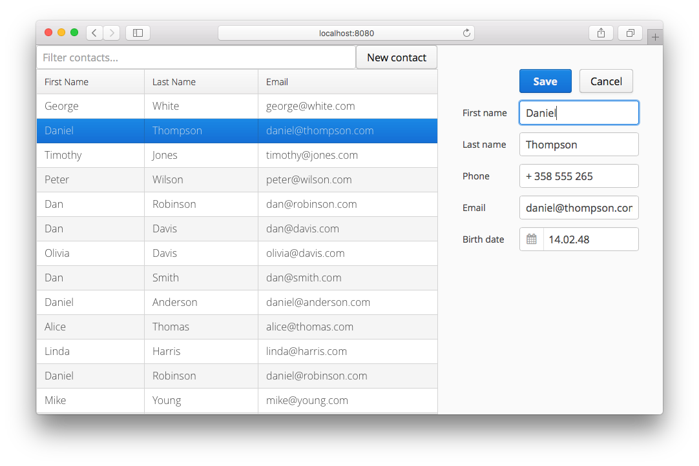

Addressbook Tutorial
====================

This tutorial teaches you some of the basic concepts in [Vaadin Framework](https://vaadin.com). It is meant to be
a fast read for learning how to get started - not an example on how application should be
designed. Please note this example uses and requires Java 8 to work.




Running the example from the command line
-------------------
```
$ mvn jetty:run
```

Open [http://localhost:8080/](http://localhost:8080/)


Importing in IntelliJ IDEA 14
--------------------
These instructions were tested on IntelliJ IDEA 14 CE. You can get it from https://www.jetbrains.com/idea/

To get the project up and running in IDEA, do:
- File -> New -> Project from Version Control -> Git
- The URL to use is https://github.com/vaadin/addressbook.git
- If you get a message about "Non-managed pom.xml file found". Choose "Add as Maven Project"
- If you get a message about no JDK or SDK being selected. Choose "Configure" and select your installed JDK. You can also set the JDK using File -> Project Structure
- To start the project, find the "Maven Projects" tab on the right hand side of the screen and navigate to
  - Vaadin Web Application -> Plugins -> jetty -> jetty:run
  - Click the play button or right click and select Run (Select Debug instead to run in debug mode)

You should now have a Jetty server running on localhost:8080. Navigate to http://localhost:8080 to play with the application

Importing in NetBeans 8
--------------------
These instructions were tested on NetBeans 8.0.2. You can get it from https://www.netbeans.org

To checkout and run the project in NetBeans, do:
- Team -> Git -> Clone
- Set repository URL to https://github.com/vaadin/addressbook.git
- Finish
- Right click the imported project (Vaadin Addressbook Application) and select Run
- Select GlassFish Server 4.1 -> Remember in Current IDE Session -> OK

You should now have a GlassFish server running on localhost:8080 and a browser tab should also be automatically opened with this location

Importing in Eclipse
--------------------
These instructions were tested on Eclipse IDE for Java EE Developers Luna SR2. You can get it from http://eclipse.org/downloads/

To checkout and run the project in Eclipse, do:
- File -> Import...
- Check out Maven Projects from SCM
- Choose Git from SCM menu
  - If you do not see "Git" in the SCM menu, click "Find more SCM connectors in the m2e Marketplace" and install "m2e-egit". Restart Eclipse and start over.
- Set the repository URL to https://github.com/vaadin/addressbook.git
- Right click the imported "addressbook" and choose Run As -> Maven Build...
  - Set the goal to "jetty:run" and click "Run"

You should now have a Jetty server running on localhost:8080. Navigate to [http://localhost:8080/](http://localhost:8080/) to play with the application

To use the built in server adapters of Eclipse, instead of doing "Run As -> Maven Build..." you can do
- Run As -> Run on Server
- Select the server you want to run on, e.g. Apache Tomcat 8 and click ok
- *Do not use the suggested J2EE Preview server* as it is outdated, deprecated and does not support Servlet 3, which is required for this application

*** End of documentation


<div align="center">

# 🚀 Enterprise DevSecOps CI/CD Platform for AddressBook Application

### Production-Ready Enterprise CI/CD Pipeline using Jenkins Dynamic Kubernetes Agents, Maven, Nexus Repository Manager, Kaniko, Kubernetes, Apache Tomcat, DevSecOps, Infrastructure Automation & Complete Observability

<p align="center">


</p>


</div>

---

# 📖 Project Overview

This repository demonstrates a **Production-Ready Enterprise DevSecOps CI/CD Pipeline** for deploying a Java-based **AddressBook Application** onto a Kubernetes platform.

The project extends the original open-source AddressBook application by implementing a complete enterprise software delivery lifecycle including Continuous Integration, Continuous Delivery, DevSecOps, Infrastructure Automation, Kubernetes orchestration, automated validation, security scanning, monitoring, distributed tracing, and automatic rollback.

The application is packaged using Maven, published to Nexus Repository Manager, containerized using Kaniko, deployed onto Kubernetes running Apache Tomcat, validated using Ansible, secured with Trivy, and monitored using a complete enterprise observability platform.

---

# 🎯 Enterprise Highlights

✔ Enterprise Jenkins Declarative Pipeline

✔ Jenkins Dynamic Kubernetes Agents

✔ GitHub Integration

✔ GitHub Actions Automation

✔ Maven Build & Packaging

✔ Nexus Repository Manager

✔ Artifact Versioning

✔ Kaniko Daemonless Image Build

✔ Private Docker Registry

✔ Kubernetes Native Deployment

✔ Apache Tomcat Deployment

✔ Infrastructure Automation using Ansible

✔ Infrastructure Auto-Fix

✔ Infrastructure Validation

✔ Parallel Pipeline Execution

✔ Trivy HTML Security Reports

✔ Critical Vulnerability Validation

✔ Automated Rollback

✔ Kubernetes Health Validation

✔ Horizontal Pod Autoscaler

✔ Prometheus Monitoring

✔ Grafana Dashboards

✔ Loki Centralized Logging

✔ Promtail Log Collection

✔ Tempo Distributed Tracing

✔ OpenTelemetry Integration

✔ AlertManager Notifications

✔ Slack Integration

✔ Enterprise Observability Platform

---

# 🏗 Enterprise Platform Infrastructure

This repository is powered by a reusable **Enterprise Platform Engineering Foundation** that provides the shared infrastructure used across multiple enterprise projects.

The platform includes:

- Enterprise Kubernetes Cluster
- Jenkins Dynamic Kubernetes Agents
- GitHub Actions
- Maven Build Platform
- Nexus Repository Manager
- Kaniko Image Builder
- Docker Registry
- Apache Tomcat
- Kubernetes Deployments
- Infrastructure Automation
- Ansible
- Trivy Security Platform
- Prometheus
- Grafana
- Loki
- Promtail
- Tempo
- OpenTelemetry
- AlertManager
- Slack Notifications
- Istio Service Mesh
- Horizontal Pod Autoscaler
- Enterprise Monitoring Platform

---

# 🔒 Platform Engineering Repository

This project uses a reusable **Enterprise Platform Engineering Repository** that contains the complete Kubernetes platform shared across all projects in this portfolio.

The repository includes:

- Kubernetes Cluster Setup
- Jenkins Infrastructure
- Dynamic Jenkins Kubernetes Agents
- Nexus Repository Manager
- Kaniko Configuration
- Docker Registry
- Apache Tomcat Platform
- Monitoring Stack
- Logging Platform
- Distributed Tracing
- DevSecOps Platform
- Infrastructure Automation
- Service Mesh
- Shared Jenkins Templates
- Platform Documentation

---

## 🔐 Private Repository

The Platform Engineering repository is intentionally maintained as a **private repository** because it contains reusable enterprise infrastructure, deployment templates, automation scripts, monitoring components, security configurations, and shared platform assets used across multiple projects.

If you are a **Recruiter**, **Hiring Manager**, **Technical Interviewer**, or **Engineering Professional** interested in reviewing the complete platform implementation, I would be happy to provide access.

### 📧 Contact

**Bharat Dasa**

**Email:** **dasabharat90@gmail.com**

Access is provided upon request for interviews, technical evaluations, and collaboration opportunities.

---

# 🌐 Enterprise Repository Ecosystem

This repository is part of a larger Enterprise Platform Engineering portfolio.

| Repository | Description | Status |
|------------|-------------|--------|
| 🏗 Platform Engineering DevOps Setup | Enterprise Kubernetes Platform, Jenkins, Nexus, Monitoring, Istio, Infrastructure Automation | 🔒 Private |
| 🚀 Enterprise DevSecOps CI/CD Platform | Production CI/CD Pipeline | 🌐 Public |
| 🤖 AI Self-Healing Platform | AI-driven Kubernetes Self-Healing | 🌐 Public |
| 💰 Enterprise Financial AI Platform | Enterprise AI Platform | 🌐 Public |
| 📊 Enterprise Monitoring Platform | Complete Observability Stack | 🌐 Public |

---

# 🏛 Enterprise Architecture

> Replace this section with your Enterprise Architecture Hero Image.

```text
                                         Developer

                                             │

                                             ▼

                                     GitHub Repository

                                             │

                                      GitHub Actions

                                             │

                                             ▼

                          Jenkins Dynamic Kubernetes Agents

                                             │

        ┌────────────────────────────────────────────────────────────┐
        │                                                            │
        │            Continuous Integration Platform                 │
        │                                                            │
        │  • Checkout Source Code                                   │
        │  • Generate Build Version                                 │
        │  • Maven Build                                            │
        │  • Package WAR                                            │
        │  • Publish Artifact to Nexus                              │
        │                                                            │
        └────────────────────────────────────────────────────────────┘

                                             │

                                             ▼

                               Nexus Repository Manager

                                             │

                                             ▼

                               Kaniko Container Builder

                                             │

                                             ▼

                              Private Docker Registry

                                             │

                                             ▼

                            Ansible Infrastructure Auto Fix

                                             │

                                             ▼

                                Parallel Validation Stage

                       ┌───────────────────────────┬────────────────────────┐

                       ▼                           ▼

          Infrastructure Validation      Trivy Security Scan

                                                    │

                                                    ▼

                                         Critical Security Validation

                                                    │

                                                    ▼

                                         Publish HTML Security Report

                                                    │

                                                    ▼

                                       Kubernetes Deployment

                                                    │

                                                    ▼

                                     Apache Tomcat Application

                                                    │

                    ┌───────────────────────────────┴──────────────────────────────┐

                    ▼                                                              ▼

             Horizontal Pod Autoscaler                                  ServiceMonitor

                    │                                                              │

                    └───────────────────────────────┬──────────────────────────────┘

                                                    ▼

                                       Enterprise Observability

                                  Prometheus

                                  Grafana

                                  Loki

                                  Promtail

                                  Tempo

                                  OpenTelemetry

                                  AlertManager

                                  Slack
```

---

# 🚀 Enterprise CI/CD Pipeline Workflow

```text
Developer

↓

GitHub Repository

↓

GitHub Actions

↓

Jenkins Pipeline

↓

Clone Source Code

↓

Generate Application Version

↓

Maven Build

↓

Package WAR

↓

Deploy Artifact to Nexus

↓

Kaniko Container Build

↓

Push Image to Registry

↓

Ansible Infrastructure Auto Fix

↓

Parallel Execution

├── Infrastructure Validation

└── Trivy Security Scan

↓

Generate HTML Security Report

↓

Critical Security Validation

↓

Deploy to Kubernetes

↓

Apache Tomcat Deployment

↓

Deploy ServiceMonitor

↓

Deploy Horizontal Pod Autoscaler

↓

Verify Prometheus

↓

Health Validation

↓

Automatic Rollback (If Required)

↓

Production Ready Application
```

---
# 🚀 Enterprise Platform Capabilities

This project demonstrates a complete Enterprise DevSecOps software delivery platform that automates the entire application lifecycle—from source code management to production deployment and runtime monitoring.

---

## 🔄 Continuous Integration (CI)

The CI pipeline is powered by **Jenkins Declarative Pipelines** running on **Dynamic Kubernetes Agents**, enabling scalable, isolated, and repeatable builds.

### Features

- Jenkins Declarative Pipeline
- Dynamic Kubernetes Build Agents
- GitHub Source Integration
- GitHub Actions Workflow Integration
- Maven Build Automation
- Automatic Version Generation
- Parallel Pipeline Execution
- Build Traceability
- Enterprise CI Workflow

---

## 📦 Artifact Repository Management

The project uses **Sonatype Nexus Repository Manager** as the centralized artifact repository.

### Features

- Maven Hosted Repository
- Snapshot Repository
- Release Repository
- Artifact Versioning
- Dependency Management
- Secure Artifact Storage
- Artifact Traceability

### Artifact Flow

```text
Developer

↓

GitHub

↓

Jenkins

↓

Maven Build

↓

Nexus Repository Manager

↓

Versioned Artifact

↓

Container Image Build
```

---

# 🐳 Container Platform

Container images are built using **Kaniko**, allowing secure container image creation directly inside Kubernetes without requiring a Docker daemon.

### Benefits

- Daemonless Image Builds
- Kubernetes Native
- OCI Compliant Images
- Immutable Container Images
- Secure Image Creation
- Automated Image Versioning
- Enterprise Ready

---

# ☸ Kubernetes Platform

Applications are deployed directly into Kubernetes using Jenkins after all validation stages complete successfully.

### Kubernetes Components

- Namespace
- Deployment
- ReplicaSet
- Pods
- Services
- Ingress
- ConfigMaps
- Secrets
- ServiceMonitor
- Horizontal Pod Autoscaler

---

## Deployment Flow

```text
Container Image

↓

Kubernetes Deployment

↓

ReplicaSet

↓

Pods

↓

Service

↓

Ingress

↓

Running Application
```

---

# 🌐 Apache Tomcat Deployment

The AddressBook application is packaged as a WAR file and deployed as a containerized Apache Tomcat application.

### Deployment Lifecycle

```text
Maven Build

↓

WAR Package

↓

Container Image

↓

Apache Tomcat

↓

Kubernetes Deployment

↓

Production Application
```

---

# ⚙ Infrastructure Automation

Infrastructure validation and automated remediation are handled using **Ansible**.

---

## Auto-Fix Stage

Automatically validates and corrects infrastructure before deployment.

### Tasks

- SSH Validation
- Kubernetes Connectivity
- Service Verification
- Infrastructure Readiness
- Node Validation
- Configuration Validation
- Automatic Corrections

---

## Pre-Deployment Validation

The deployment pipeline verifies:

- CPU Availability
- Memory Availability
- Disk Space
- Kubernetes API
- Namespace
- Services
- Networking
- Node Status

Deployment continues only after successful validation.

---

# 🔐 Enterprise DevSecOps

Security is integrated throughout the CI/CD lifecycle.

---

## Trivy Vulnerability Scanning

Every container image is scanned before deployment.

### Pipeline

```text
Container Image

↓

Trivy Scan

↓

HTML Report

↓

Critical Vulnerability Validation

↓

Deploy
```

---

## Security Features

- Vulnerability Scanning
- Critical CVE Detection
- HTML Security Reports
- Security Gates
- Infrastructure Validation
- Automated Rollback
- Immutable Images

---

## Security Gates

Every deployment must pass:

✅ Maven Build

✅ Artifact Upload

✅ Container Build

✅ Trivy Scan

✅ Critical Vulnerability Validation

✅ Infrastructure Validation

✅ Kubernetes Rollout

✅ Health Check

---

# 📊 Enterprise Observability Platform

A complete observability platform provides visibility into infrastructure and application health.

---

## 📈 Metrics

Technology

- Prometheus

Collected Metrics

- Kubernetes
- JVM
- Apache Tomcat
- Application
- Nodes
- Pods
- Services
- Network

---

## 📊 Dashboards

Technology

- Grafana

Available Dashboards

- Cluster Overview
- Kubernetes
- JVM
- Apache Tomcat
- CPU
- Memory
- Network
- Storage
- HPA

---

## 📜 Logging

Technologies

- Loki
- Promtail

Capabilities

- Centralized Logs
- Pod Logs
- Container Logs
- Application Logs
- Kubernetes Events

---

## 🔍 Distributed Tracing

Technology

- Tempo

Provides

- Request Flow
- Dependency Mapping
- Latency Analysis
- Performance Monitoring

---

## 📡 OpenTelemetry

Provides unified telemetry for

- Metrics
- Logs
- Traces

---

## 🚨 Alerting

Technologies

- AlertManager
- Slack

Alert Types

- Pod Failure
- High CPU
- High Memory
- Deployment Failure
- Application Down
- Node Failure

---

# 🌐 Service Mesh

The platform is designed to support **Istio Service Mesh**.

### Features

- Traffic Management
- Telemetry
- mTLS Ready
- Distributed Tracing
- Retry Policies
- Traffic Routing

---

# 📈 Horizontal Pod Autoscaler

Applications automatically scale based on workload.

### Scaling Flow

```text
User Traffic

↓

CPU / Memory Usage

↓

Horizontal Pod Autoscaler

↓

Scale Pods

↓

Application Remains Available
```

---

# 🔄 Automated Health Validation

Every deployment is verified before completion.

### Validation

- Deployment Status
- Replica Availability
- Pod Health
- CrashLoopBackOff Detection
- Rollout Status

If deployment fails:

```text
Deployment Failure

↓

Automatic Rollback

↓

Previous Stable Version

↓

Service Restored
```

---

# 📂 Repository Structure

```text
DevOpsClassCodes/
│
├── .github/
│   └── workflows/
│
├── ansible/
│   ├── auto-fix.yml
│   ├── precheck.yml
│   ├── inventory.ini
│   └── roles/
│
├── docs/
│   ├── images/
│   ├── ARCHITECTURE.md
│   ├── PIPELINE.md
│   ├── SECURITY.md
│   ├── OBSERVABILITY.md
│   ├── DEPLOYMENT.md
│   └── README.md
│
├── k8s/
│   ├── deployment.yaml
│   ├── service.yaml
│   ├── ingress.yaml
│   ├── hpa.yaml
│   ├── servicemonitor.yaml
│   └── namespace.yaml
│
├── Dockerfile
├── Jenkinsfile
├── pom.xml
├── src/
└── README.md
```

---

# 💻 Technology Stack

| Layer | Technology |
|---------|------------|
| Source Control | GitHub |
| Workflow Automation | GitHub Actions |
| CI/CD | Jenkins |
| Build Tool | Maven |
| Artifact Repository | Nexus Repository Manager |
| Container Builder | Kaniko |
| Container Registry | Nexus Docker Hosted Repository |
| Container Orchestration | Kubernetes |
| Application Server | Apache Tomcat |
| Infrastructure Automation | Ansible |
| Security | Trivy |
| Monitoring | Prometheus |
| Dashboard | Grafana |
| Logging | Loki + Promtail |
| Distributed Tracing | Tempo |
| Telemetry | OpenTelemetry |
| Autoscaling | Kubernetes HPA |
| Service Mesh | Istio |
| Notifications | AlertManager + Slack |

---

# 📚 Documentation

| Document | Description |
|----------|-------------|
| README.md | Project Overview |
| ARCHITECTURE.md | Enterprise Architecture |
| PIPELINE.md | Jenkins Pipeline |
| SECURITY.md | DevSecOps & Security |
| OBSERVABILITY.md | Monitoring & Logging |
| DEPLOYMENT.md | Deployment Guide |
| TROUBLESHOOTING.md | Common Issues & Solutions |

---

# 🛣 Roadmap

Planned enhancements:

- SonarQube Integration
- OWASP Dependency Check
- SBOM Generation
- Cosign Image Signing
- HashiCorp Vault
- Blue-Green Deployments
- Canary Deployments
- Progressive Delivery
- KEDA Event-Driven Autoscaling
- AI-Based Self-Healing
- Chaos Engineering
- Multi-Cluster Kubernetes
- Policy as Code (OPA / Kyverno)

---

# 👨‍💻 Author

## Bharat Dasa

**Enterprise Platform Engineer | DevOps Engineer | DevSecOps | Kubernetes | Cloud Native | Platform Engineering | Observability**

### 📧 Contact

**Email:** dasabharat90@gmail.com

**GitHub:** https://github.com/BharatDasa

**LinkedIn:** *(Add your LinkedIn profile URL here.)*

---

# 🤝 Contributing

Contributions are welcome!

If you have ideas for improving the project, please:

1. Fork the repository
2. Create a feature branch
3. Commit your changes
4. Submit a Pull Request

Please read the `CONTRIBUTING.md` guide before contributing.

---

# ⭐ Support

If you found this repository useful:

⭐ Star the repository

🍴 Fork the project

🛠 Share feedback

📩 Reach out for collaboration opportunities

---

# 📄 License

This project is licensed under the **MIT License**.

See the `LICENSE` file for complete details.

---

<div align="center">

# 🚀 Enterprise DevSecOps • Kubernetes • Platform Engineering • Cloud Native

**A production-ready demonstration of modern CI/CD, DevSecOps, Kubernetes, observability, and infrastructure automation built using enterprise engineering practices.**

⭐ **If you enjoyed this project, please consider giving it a Star!**

</div>
